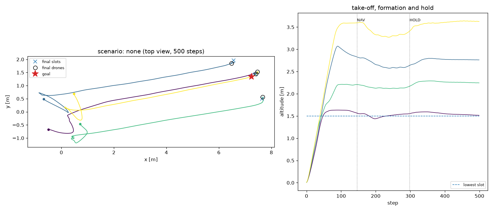
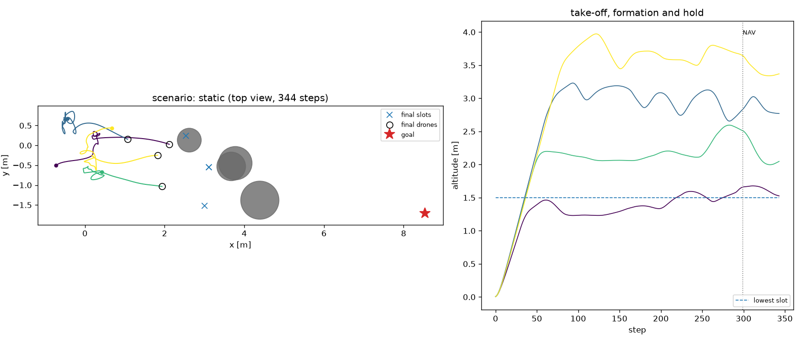
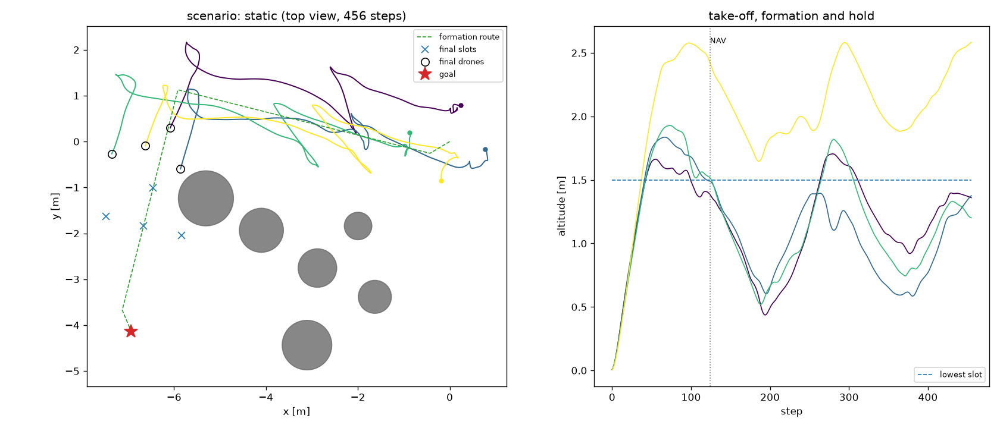
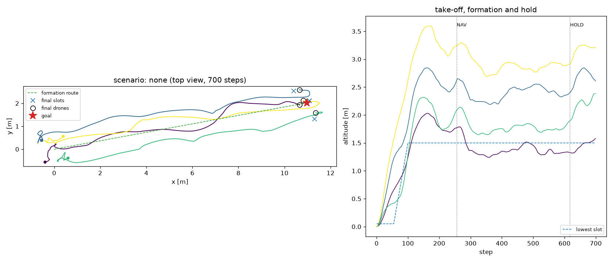

# Point-mass sanity check: learning with and without obstacles

These runs use `FormationNavLite`, the same task, observations, actions and rewards as the
Isaac Sim environment, but with point-mass drones (first-order velocity tracking). They are
**not Isaac Sim results**. They check that the task is learnable and show which design choices
matter before spending GPU time. They are also where the default settings came from.

> **These runs predate the switch to the Crazyflie defaults.** They used:
> * the Hummingbird sizes: formation and take-off spacing 1.2 m, drone radius 0.25 m,
>   collision distance 0.35 m, avoidance penalty from 0.7 m, obstacle penalty from 0.6 m;
> * a simultaneous take-off (no staging);
> * the plain greedy slot assignment.
>
> The point-mass dynamics do not depend on the drone. For a comparable setup today, add
> `--set formation_spacing=1.2 ground_spacing=1.2 drone_radius=0.25 collision_dist=0.35 safe_dist=0.7 obstacle_safe_dist=0.6 spawn_height=0.1 staged_takeoff=False`.
> The assignment is now always crossing-free.

**Setup (runs A–E).**

* 4 drones; the formation is sampled per episode from cube / sphere / pyramid / plane.
* Goal 8–12 m away in a random direction; 700-step (22 s) episodes.
* 64 parallel envs; 500 PPO iterations × 64 steps (≈ 2 M env steps, ~23 min on 4 CPU cores).
* MAPPO-LSTM with hidden size 128.
* Training scenario: a random mix of none / static / dynamic / mixed (20 / 30 / 20 / 30 %).

Run A0 is different: trained without obstacles, with 5–8 m goals and 500-step episodes, for
400 iterations. It is not directly comparable to A–E.

**Evaluation.** One deterministic episode in each of 32 envs per scenario, at full obstacle
difficulty. With 32 episodes a success rate has a standard error of about ±9 %, and every run
used a single seed, so small differences are noise.

* success: reached the hold phase at the goal.
* hold ratio: fraction of hold time with every drone within 0.3 m of its slot.
* route progress: fraction of the start→goal distance covered.
* obstacle / drone-drone crash: the episode ended by that collision.

## Results

**A0: trained without obstacles (constant lr, input LayerNorm; 5–8 m routes)**

| metric | none | static | dynamic | mixed |
|---|---|---|---|---|
| success | 78% | 0% | 38% | 0% |
| hold ratio | 62% | 0% | 12% | 0% |
| route progress | 78% | 28% | 54% | 26% |
| formation error | 0.004 | 0.017 | 0.008 | 0.009 |
| time to goal [s] | 8.1 | – | 10.1 | – |

(crash causes were not yet logged in this run)

**A: obstacle mix, straight waypoints (constant lr, input LayerNorm)**

| metric | none | static | dynamic | mixed |
|---|---|---|---|---|
| success | 88% | 3% | 34% | 3% |
| hold ratio | 75% | 3% | 22% | 0% |
| route progress | 87% | 26% | 55% | 30% |
| obstacle crash | 0% | 81% | 47% | 88% |
| drone-drone crash | 12% | 16% | 19% | 9% |
| formation error | 0.010 | 0.017 | 0.011 | 0.027 |
| time to goal [s] | 10.8 | 13.2 | 10.7 | 11.5 |

**C: A + formation relaxation near obstacles + running input norm + LR decay**

| metric | none | static | dynamic | mixed |
|---|---|---|---|---|
| success | 94% | 0% | 31% | 0% |
| hold ratio | 45% | 0% | 10% | 0% |
| route progress | 97% | 27% | 58% | 25% |
| obstacle crash | 0% | 91% | 62% | 81% |
| drone-drone crash | 3% | 9% | 3% | 16% |
| formation error | 0.012 | 0.017 | 0.021 | 0.018 |
| time to goal [s] | 13.1 | – | 14.9 | – |

**D: running input norm + LR decay + obstacle curriculum**

| metric | none | static | dynamic | mixed |
|---|---|---|---|---|
| success | 97% | 0% | 22% | 0% |
| hold ratio | 64% | 0% | 3% | 0% |
| route progress | 97% | 19% | 50% | 16% |
| obstacle crash | 0% | 56% | 38% | 50% |
| drone-drone crash | 3% | 38% | 38% | 28% |
| formation error | 0.005 | 0.050 | 0.027 | 0.058 |
| time to goal [s] | 11.6 | – | 17.9 | – |

**E: running input norm + LR decay + route planned around the pillars (`waypoint_planner: dp`, now the default)**

| metric | none | static | dynamic | mixed |
|---|---|---|---|---|
| success | 88% | **50%** | 38% | **28%** |
| hold ratio | 34% | 6% | 9% | 2% |
| route progress | 98% | **82%** | 64% | 51% |
| obstacle crash | 0% | **28%** | 47% | 59% |
| drone-drone crash | 3% | 3% | 9% | 6% |
| formation error | 0.013 | 0.024 | 0.017 | 0.034 |
| time to goal [s] | 13.1 | 18.2 | 14.0 | 19.1 |

## What this shows

1. **Without obstacles the task is learned well.** 88–97 % of episodes take off from the
   ground, build the 3-D formation, fly 8–12 m and reach the hold phase. The formation error is
   0.005–0.013 (normalised Procrustes).

   

   *A0 episode: take-off from z = 0 into a 3-D formation (slots at 1.5–3.6 m), navigation from
   step ~150, hold from step ~300 to the end of the episode.*

2. **A policy that never saw obstacles fails on them** (A0: static 0 %, dynamic 38 %).
   Obstacle scenarios have to be part of training.

3. **Straight-line waypoints (the paper's method) make static pillars almost unsolvable.** The
   straight route intersects a pillar for the rigid formation in 93–98 % of static episodes, so
   every formation-keeping reward term pulls drones into the obstacle. Static success stayed at
   0–3 % across:
   * reward relaxation near obstacles (C);
   * input normalisation (C, D);
   * an obstacle curriculum (D).

   

4. **Planning the formation route around the known pillars fixes this** (E,
   `waypoint_planner: dp`):
   * static success: 0–3 % → 50 %;
   * static route progress: 26 % → 82 %;
   * mixed success: 0–3 % → 28 %.

   Moving obstacles are still avoided by the learned policy alone (dynamic 38 %).
   `waypoint_planner: straight` reproduces the paper.

   

   More episodes: [none](figures/pointmass_dp_route_none.png),
   [dynamic](figures/pointmass_dp_route_dynamic.png),
   [mixed](figures/pointmass_dp_route_mixed.png).

5. **Still open at this small budget:**
   * hold precision at the goal (E's hold ratio is 34 %, vs 64–75 % for A and D);
   * moving obstacles (47–59 % obstacle crashes in dynamic / mixed).

   The paper trained for 25 M steps with 8 drones; these runs use 2 M steps with 4 drones.
   Isaac Sim training with 512 envs × 8 drones reaches that scale quickly.

Other observations:

* Running input normalisation + LR decay (C, D, E) reduced drone-drone crashes without
  obstacles (12 % → 3 %).
* The curriculum (D) roughly halved obstacle crashes, but without a feasible route it did not
  turn them into successes. It is available as `obstacle_curriculum: true`.

## Reproduce

```bash
cd omnidrones_formation
python scripts/train_lite.py --num_envs 64 --num_drones 4 --iters 500 --max_episode_length 700 \
    --goal_min 8 --goal_max 12 --scenario train_mix --hidden_size 128 --out runs/E --set "num_static=(3,6)"
python scripts/eval_lite.py --checkpoint runs/E/checkpoint.pt --num_drones 4 --hidden_size 128 \
    --goal_min 8 --goal_max 12 --max_episode_length 700 --out runs/E_eval
# variants (A-D): --set waypoint_planner=straight   /   --set obstacle_curriculum=True
#                 --set relax_dist=1.2 obstacle_safe_dist=1.0   /   --input_norm layernorm
```

Note: runs A–E used 3–6 pillars (hence `--set "num_static=(3,6)"`). The default is now 2–4:
the default 8-drone formation is about 3.4 m wide, and with 3–6 pillars in the corridor a
collision-free route for the rigid formation exists in only 55 % of layouts (78 % with 2–4).

## After the switch to the Crazyflie defaults: point mass vs rigid-body Crazyflie (F, G)

Setup:

* the Crazyflie sizes, staged take-off and crossing-free assignment;
* 4 drones, formation pool, **no obstacles**, 8–12 m goals, 700-step episodes;
* 64 envs, 400 iterations × 64 steps (1.6 M env steps), hidden size 128, one seed;
* F: point-mass dynamics;
* G: `--dynamics quadrotor`: the rigid-body Crazyflie with OmniDrones' rotor model and
  downwash, flown by the Lee controller with the downwash feed-forward at 62.5 Hz. This is the
  closest CPU stand-in for the Isaac Sim env.

| scenario `none`, 32 episodes | F: point mass | G: rigid-body Crazyflie |
|---|---|---|
| success | 1.00 | 0.91 |
| hold ratio | 0.75 | 0.00 |
| formation error | 0.018 | 0.077 |
| slot error (episode mean) | 0.48 m | 0.75 m |
| time to form | 4.8 ± 1.7 s | 5.9 ± 1.7 s |
| time to goal | 12.5 ± 2.2 s | 16.7 ± 2.8 s |
| crashed | 0 | 0.06 (out of bounds) |

* **The new defaults are learnable.** The point-mass policy takes off, forms, flies and holds
  in every episode.
* **The rigid-body Crazyflie reaches the goal in 91 % of episodes, but does not stop
  precisely yet.** Its velocity loop settles in about 0.8 s, against 0.15 s for the point mass.
  With this budget the policy still overshoots its slot during take-off, and keeps drifting
  about ±0.3 m at the goal. The strict hold criterion (every drone within 0.3 m of its slot and
  slower than 0.3 m/s) is therefore almost never met.
* **Training was still improving:** training success rose from 0.03 at iteration 208 to 0.8 at
  iteration 390. Precise holding needs Isaac-scale training (512 envs, ~100 M steps), or
  pre-training on the quadrotor backend. The point mass overestimates how fast holding is
  learned.



```bash
python scripts/train_lite.py --num_envs 64 --num_drones 4 --iters 400 --max_episode_length 700 \
    --scenario none --goal_min 8 --goal_max 12 --hidden_size 128 --device cpu [--dynamics quadrotor] --out runs/G
```
